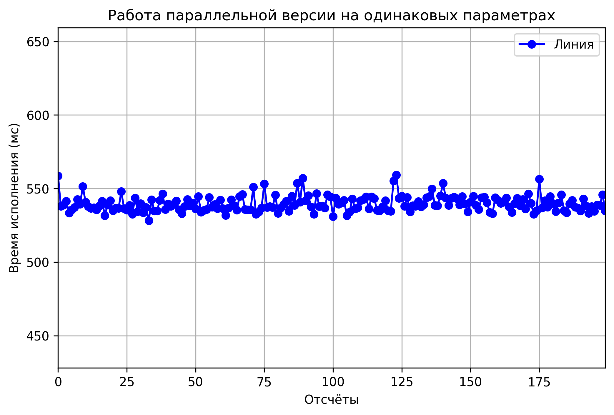

# PiROD
Лабораторная работа 1.

## Задание
### Параллельные вычисления и пределы масштабирования

Ограничения лабораторной работы:
- Допустимые языки программирования: C/C++, Python.
- Задачи где присутствует элемент случайности seed должны совпадать в рамках сравнительных экспериментов.
- Вариант: Нахождение элементов, сильно отличающихся от среднего значения (> k·σ).

Этапы выполнения:
- Реализовать последовательную версию решения задачи.
- Реализовать параллельную версию решения задачи. Добавить параметр, ограничивающий допустимый уровень параллелизма (максимальное количество доступных ядер/потоков). Объяснить какую часть задачи можно распараллелить, а какую нельзя.
- Продемонстрировать работу двух версий программ на одинаковых входных параметрах. Результаты должны совпадать.
- Провести анализ детерминизма. Продемонстрировать работу параллельной версии на одинаковых параметрах при N запусках, где N > 100.
- Провести эксперименты для различных входных данных на последовательной и параллельной версии программы. Продемонстрировать масштабируемость решения и влияние увеличения/уменьшения количества доступных ресурсов на итоговый результат. Эксперименты должны быть при различных параметра параллелизма: 1, 2, …, MAX(CPU)/2, …, MAX(CPU), MAX(CPU) * 2, MAX(CPU) * 4.
- Замерить время выполнения, ускорение и эффективность при различных параметрах. Построить графики метрик для полученных экспериментов.
- Объяснить особенности параллелизма для выбранного вами языка программирования. Указать узкие места.

Усложненный вариант:
- Реализация на C/C++.

## Решение

1. Последовательная и параллельная версии решения, а также вспомогательная функция для поиска выбросов, объединены в файле [outliers_catchers.py](outliers_catchers.py).

```python
def squential_catch_outliers(values: list[float], k: float) -> list[float]:
    mean_values = sum(values) / len(values)
    std_values = math.sqrt(
        sum((x - mean_values) ** 2 for x in values) / len(values))
    threshold = k*std_values

    with ProcessPoolExecutor(max_workers=1) as executor:
        results = executor.map(find_outliers, [values],
                               repeat(mean_values), repeat(threshold))

    outliers = []
    for part in results:
        outliers.extend(part)

    return outliers
```

Как работает:
- mean, std и threshold считаются один раз,
- затем используется функция `find_outliers` из того же файла [outliers_catchers.py](outliers_catchers.py), которая возвращает выбросы.

```python
def find_outliers(chunk: list[float], mean: float, threshold: float) -> list[float]:
    return [x for x in chunk if abs(x - mean) > threshold]
```

2. Параллельная версия также находится в файле [outliers_catchers.py](outliers_catchers.py). Добавлен параметр `workers`, ограничивающий допустимый уровень параллелизма.

```python
def parallel_catch_outliers(values: list[float], k: float, workers: int = 4) -> list[float]:
    mean_values = sum(values) / len(values)
    std_values = math.sqrt(sum((x - mean_values) ** 2 for x in values) / len(values))
    threshold = k*std_values
    
    chunk_size = max(1, math.ceil(len(values) / workers))
    chunks = [values[i:i + chunk_size] for i in range(0, len(values), chunk_size)]

    with ProcessPoolExecutor(max_workers=workers) as executor:
        results = executor.map(find_outliers, chunks, repeat(mean_values), repeat(threshold))

    outliers = []
    for part in results:
        outliers.extend(part)

    return outliers
```

Как работает:
- mean, std и threshold считаются один раз,
- массив делится на части, и каждая часть обрабатывается в отдельном процессе,
- список значений, среднее и порог передаются функции `find_outliers` из того же файла [outliers_catchers.py](outliers_catchers.py), которая возвращает выбросы.

В этой задаче распараллеливается не все, а только независимая обработка элементов после подготовки общих параметров.

Нельзя напрямую распараллелить без оговорок:
- Вычисление итогового `mean` как готового одного числа.
- Вычисление итогового `std` как готового одного числа.
- Потому что это глобальные характеристики всего массива: они зависят от всех элементов сразу.

Но их можно вычислять поэтапно параллельно:
- Разбить массив на куски.
- Для каждого куска параллельно посчитать частичную сумму.
- Потом объединить частичные суммы и получить `mean`.
- Дальше так же параллельно посчитать частичные суммы квадратов отклонений от `mean`.
- Потом объединить их и получить `std`.

Точно хорошо распараллеливается:
- Проверка каждого элемента на условие `abs(x - mean) > k * std`.
- После того как `mean` и `std` уже известны, каждый элемент проверяется независимо от других.
- Поэтому массив можно разбить на части, и каждый поток/процесс будет искать выбросы только в своем куске.

3. Для демостриции работы алгоритмов в файле []() были реализованы функции `generate_random_floats` - для генерации списка значений и `compare_outliers_catchers` - для вычисления времени работы алгоритмов.

Параметры:
- длина списка: 100.000
- k: 0.2
- кол-во ядер: 4

Результы:
- Sequential time: 0.100873 s
- Parallel time: 0.094917 s
- Speedup: 1.062749
- Efficiency: 0.265687

4. Анализ детерминизма для N = 200 показывает, что в среднем алгоритм отрабатывает за ... .

Параметры:
- n: 200
- длина списка: 100.000
- k: 0.2
- кол-во ядер: 4

