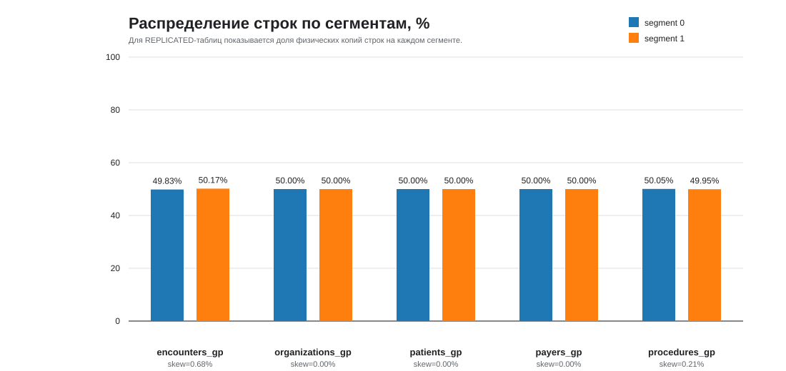
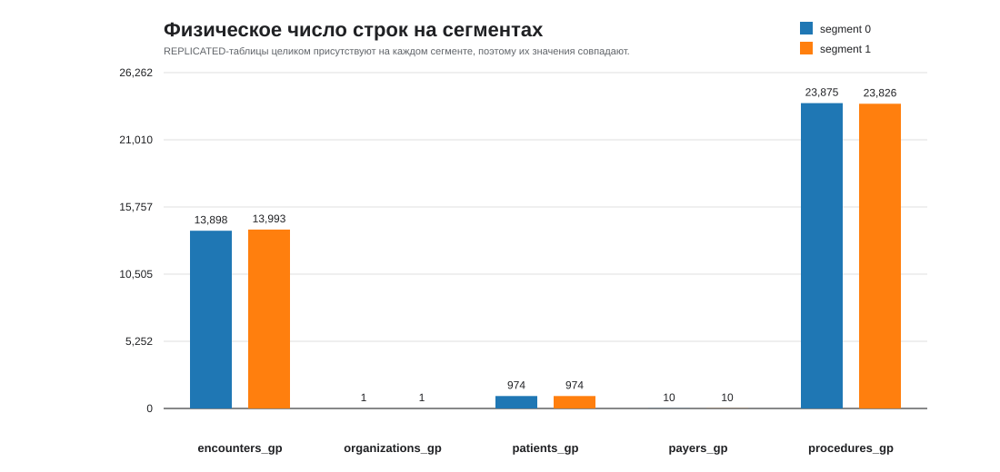

# PiROD
Лабораторная работа 3.

# Задание
## MPP-архитектура и моделирование данных в Greenplum

В рамках данной работы вы решите задачу интеграции Greenplum с другими хранилищами с помощью PXF, а также изучите особенности данного хранилища и ограничения, которые необходимо учитывать при работе с ним.

- Упрощенный вариант: 70% от максимального балла
- Усложненный вариант: полный балл

Этапы выполнения:
- Развернуть с помощью docker compose GreenPlum кластер из одной мастер ноды и двух сегмент нод, а также дополнительное хранилище в соответствие с вариантом
- Выбрать датасет - https://mavenanalytics.io/data-playground. Данные из него загрузить в дополнительное хранилище из вашего варианта, объём загрузки должен быть не менее 3 таблиц. Датасет должен иметь тег Multiple Table. Построить ER-диаграмму для выбранного датасета.
- Загрузить данные в GreenPlum с помощью PXF. При переносе данных на GreenPlum выбрать ключи дистрибьюции, аргументировать свой выбор.
- Проанализировать распределение данных по сегментам. Построить графики демонстрирующие процент распределения данных на сегментах, объяснить почему получена именно такая картина. Оценить перекос данных.
- Сформировать запросы с использованием множества таблиц. Проанализировать планы запросов полученных запросов, изменить ключи дистрибьюции у таблиц и проанализировать изменения планов запросов. Детально объяснить motion для каждого запроса. Общее число запросов должно быть не менее 3.

Усложненный вариант:
- Сформировать Dockerfile для развертывания gpfdist. Смонтировать директорию контейнера и загрузить в нее csv файл. Создать External Table, связанную с gpfdist, выгрузить данные из csv файла в таблицу.

# Решение

- Вариант - MinIO.
- Датасет - [Hospital Patient Records](https://mavenanalytics.io/data-playground/hospital-patient-records).
- Docker образ Greenplum - [woblerr/greenplum](https://hub.docker.com/r/woblerr/greenplum).
- Docker образ MinIO - [minio/minio](https://hub.docker.com/r/minio/minio).

1. Устанавливаем переменные окружения:

```
# Greenplum 
IMAGE_NAME=woblerr/greenplum
TAG=6.27.1-v0.7
GREENPLUM_PASSWORD=gparray
GREENPLUM_DATABASE_NAME=lab3

# Minio
MINIO_ROOT_USER=minioadmin
MINIO_ROOT_PASSWORD=minioadmin
```

2. Запускаем командой `make up` и проверяем, что у нас кластер из одной мастер ноды и двух сегмент нод, а также доступ к MinIO:

Смотрим на конфигурации сегментов:

```bash
gpadmin@pirod_greenplum:~$ psql -d lab3 -c "SELECT content, role, preferred_role, hostname, address, port, datadir
FROM gp_segment_configuration
ORDER BY content, role;"
 content | role | preferred_role |    hostname     |     address     | port |         datadir         
---------+------+----------------+-----------------+-----------------+------+-------------------------
      -1 | p    | p              | pirod_greenplum | pirod_greenplum | 5432 | /data/master/gpseg-1
       0 | p    | p              | pirod_greenplum | pirod_greenplum | 6000 | /data/00/primary/gpseg0
       1 | p    | p              | pirod_greenplum | pirod_greenplum | 6001 | /data/01/primary/gpseg1
(3 rows)
```

Можно увидеть, что у нас 1 coordinator, 2 сегмента и всё на одном сервере.

Проверяем доступ к MinIO:

```bash
gpadmin@pirod_greenplum:~$ ping pirod_minio -c 3
PING pirod_minio (172.19.0.3): 56 data bytes
64 bytes from 172.19.0.3: icmp_seq=0 ttl=64 time=0.763 ms
64 bytes from 172.19.0.3: icmp_seq=1 ttl=64 time=0.398 ms
64 bytes from 172.19.0.3: icmp_seq=2 ttl=64 time=0.349 ms
--- pirod_minio ping statistics ---
3 packets transmitted, 3 packets received, 0% packet loss
round-trip min/avg/max/stddev = 0.349/0.503/0.763/0.185 ms
```

> Команда `make up` создаёт и запускает контейнер, а также внутри `/data/pxf/servers` копирует `minio/s3-site.xml` файл с настройками подключения.

3. Заходим по `http://localhost:9001`, создаём корзину `hospitalpatientrecords` и загружаем CSV файлы: `encounters.csv`, `organizations.csv`, `patients.csv`, `payers.csv` и `procedures.csv`. ER-диаграммы выглядят следующим образом:


4. Загрузка данных в GreenPlum с помощью PXF с ключами дистрибьюции выполняется после того, как CSV-файлы уже загружены в корзину MinIO. Для этого сначала проверяем, что PXF читает данные:

```bash
make check-export
```

После этого запускаем перенос из внешних PXF-таблиц во внутренние таблицы Greenplum:

```bash
make load-pxf
```

Используемый SQL-сценарий: `lab3/sql/load_from_pxf.sql`.

С помощью PXF были созданы внешние таблицы `ext_patients`, `ext_organizations`, `ext_payers`, `ext_encounters`, `ext_procedures`, каждая из которых читает CSV напрямую из MinIO через `PROFILE=s3:text&SERVER=minio`. Далее данные вставляются во внутренние таблицы `patients_gp`, `organizations_gp`, `payers_gp`, `encounters_gp`, `procedures_gp`.

Ключи дистрибьюции были выбраны исходя из размеров таблиц и характера соединений:

- `organizations_gp` и `payers_gp` созданы как `DISTRIBUTED REPLICATED`, потому что это очень маленькие справочники. В датасете фактически 1 организация и 10 плательщиков, поэтому репликация на все сегменты дешевле любого redistribution motion.
- `patients_gp` тоже создана как `DISTRIBUTED REPLICATED`. Таблица содержит 974 пациента, то есть остаётся компактным измерением. Её часто соединяют с таблицами фактов по `patient`, поэтому репликация убирает необходимость перемещать факты между сегментами.
- `encounters_gp` создана с `DISTRIBUTED BY (id)`, так как `id` — высококардинальный идентификатор визита, практически уникальный для каждой строки (`27891` визитов). Это даёт ровное распределение и делает таблицу базовой для коллокации с процедурами.
- `procedures_gp` создана с `DISTRIBUTED BY (encounter)`, потому что самая тяжёлая связь в модели — `procedures -> encounters` по идентификатору визита. Тогда строки процедур и соответствующие им визиты попадают на один и тот же сегмент, и join между двумя крупнейшими таблицами выполняется локально без лишнего `Redistribute Motion`.

Таким образом, основная идея выбора следующая: маленькие измерения реплицируются, а две наиболее крупные таблицы коллоцируются по ключу визита (`encounter` / `id`). Это уменьшает сетевые пересылки в самых дорогих соединениях и даёт более предсказуемые планы выполнения.

5. Анализ распределения данных по сегментам выполнялся прямым подключением к каждому сегменту в utility mode:

```bash
PGOPTIONS='-c gp_session_role=utility' psql -p 6000 -d lab3
PGOPTIONS='-c gp_session_role=utility' psql -p 6001 -d lab3
```

Фактические физические количества строк на сегментах:

| Таблица | Segment 0 | Segment 1 | Доля seg0 | Доля seg1 | Перекос |
|---------|-----------:|-----------:|----------:|----------:|--------:|
| `patients_gp` | 974 | 974 | 50.00% | 50.00% | 0.00% |
| `organizations_gp` | 1 | 1 | 50.00% | 50.00% | 0.00% |
| `payers_gp` | 10 | 10 | 50.00% | 50.00% | 0.00% |
| `encounters_gp` | 13898 | 13993 | 49.83% | 50.17% | 0.68% |
| `procedures_gp` | 23875 | 23826 | 50.05% | 49.95% | 0.21% |

Под перекосом здесь понимается величина `(max_rows - min_rows) / avg_rows * 100%`.

Графики распределения:





Почему получилась именно такая картина:

- `patients_gp`, `organizations_gp`, `payers_gp` созданы как `DISTRIBUTED REPLICATED`, поэтому каждая строка хранится на каждом сегменте. Из-за этого на графике абсолютных значений обе колонки равны, а в процентах мы видим ровно `50/50` от общего числа физических копий.
- `encounters_gp` распределена по `id`, а `id` в этой таблице почти уникален и имеет высокую кардинальность. Для хеш-распределения это хороший ключ, поэтому строки делятся между двумя сегментами почти поровну.
- `procedures_gp` распределена по `encounter`, чтобы коллоцировать данные с `encounters_gp`. Хотя в `procedures` на один `encounter` может приходиться несколько строк, сам ключ всё равно остаётся достаточно разнообразным, поэтому заметного перекоса не возникло.

Оценка перекоса:

- Для `encounters_gp` перекос `0.68%`, что очень мало и говорит о практически равномерном распределении.
- Для `procedures_gp` перекос `0.21%`, то есть распределение ещё ровнее.
- Для реплицированных таблиц перекос отсутствует, но это следствие не хеш-распределения, а полного копирования таблицы на каждый сегмент.

Итог: выбранные ключи дистрибьюции можно считать удачными. Крупные таблицы распределены почти равномерно, а маленькие справочники реплицированы, поэтому сеть не тратится на лишние `Redistribute Motion` в частых join-операциях.

6. Анализ планов запросов и влияние изменения ключей дистрибьюции.

Для сравнения были созданы альтернативные таблицы с заведомо менее удачными ключами распределения:

- `patients_gp_alt DISTRIBUTED BY (city)`
- `organizations_gp_alt DISTRIBUTED BY (name)`
- `payers_gp_alt DISTRIBUTED BY (name)`
- `encounters_gp_alt DISTRIBUTED BY (patient)`
- `procedures_gp_alt DISTRIBUTED BY (code)`

SQL для создания альтернативной схемы находится в `lab3/sql/create_alt_distribution.sql`, а все `EXPLAIN`-запросы собраны в `lab3/sql/explain_motions.sql`.

Физическое распределение альтернативных таблиц оказалось хуже:

| Таблица | Segment 0 | Segment 1 | Перекос |
|---------|-----------:|-----------:|--------:|
| `patients_gp_alt` | 202 | 772 | 117.04% |
| `organizations_gp_alt` | 1 | 0 | 200.00% |
| `payers_gp_alt` | 5 | 5 | 0.00% |
| `encounters_gp_alt` | 13468 | 14423 | 6.85% |
| `procedures_gp_alt` | 21047 | 26654 | 23.51% |

Это уже показывает, что новые ключи хуже подходят для MPP: часть из них не совпадает с основными join-ключами, а часть ещё и даёт заметный skew.

Ниже рассматриваются три многотабличных запроса.

**Запрос 1**

```sql
SELECT
    e.encounterclass,
    p.description,
    COUNT(*) AS procedure_cnt
FROM encounters_gp e
JOIN procedures_gp p
    ON p.encounter = e.id
JOIN patients_gp pt
    ON pt.id = e.patient
JOIN payers_gp py
    ON py.id = e.payer
GROUP BY e.encounterclass, p.description
ORDER BY procedure_cnt DESC
LIMIT 10;
```

Что происходит в оптимизированной схеме:

- Join `procedures_gp -> encounters_gp` выполняется локально, потому что `procedures_gp` распределена по `encounter`, а `encounters_gp` по `id`. Для Greenplum это коллокация одной и той же логической сущности визита.
- Join с `patients_gp` и `payers_gp` также не требует движения больших таблиц, потому что это `REPLICATED`-измерения.
- Единственный существенный `Redistribute Motion 2:2` появляется уже после локальной агрегации, когда нужно собрать одинаковые пары `(encounterclass, description)` на одном сегменте для глобального `GROUP BY`.
- `Gather Motion 2:1` в конце нужен, чтобы передать итоговые строки на coordinator для `ORDER BY ... LIMIT`.

Что меняется в альтернативной схеме:

- Появляется `Redistribute Motion` для `procedures_gp_alt` по `encounter`, потому что таблица физически распределена по `code`, а join выполняется по `encounter`.
- Появляется ещё один `Redistribute Motion` для `encounters_gp_alt` по `id`, потому что таблица распределена по `patient`, а join с процедурами идёт по `id`.
- `patients_gp_alt` тоже приходится перераспределять по `id`, так как она хранится по `city`, а соединяется по `id`.
- `payers_gp_alt` оптимизатор решает двигать через `Broadcast Motion`, потому что таблица маленькая, и дешевле разослать её целиком на оба сегмента, чем перестраивать большой поток визитов.
- После этого остаются те же финальные `Redistribute Motion` для глобальной агрегации и `Gather Motion` для выдачи результата.

Вывод по запросу 1: в хорошей схеме `Motion` связан только с финальной агрегацией, а в плохой схеме сеть тратится уже на подготовку join-ов, включая обе крупные таблицы.

**Запрос 2**

```sql
SELECT
    pt.city,
    pt.state,
    py.name,
    COUNT(*) AS encounter_cnt,
    ROUND(AVG(e.total_claim_cost)::numeric, 2) AS avg_claim
FROM encounters_gp e
JOIN patients_gp pt
    ON pt.id = e.patient
JOIN payers_gp py
    ON py.id = e.payer
JOIN organizations_gp o
    ON o.id = e.organization
GROUP BY pt.city, pt.state, py.name
ORDER BY encounter_cnt DESC
LIMIT 10;
```

Что происходит в оптимизированной схеме:

- Все join-ы выполняются без отдельного `Motion` на этапе соединений, потому что `encounters_gp` большая таблица, а `patients_gp`, `payers_gp`, `organizations_gp` реплицированы.
- Основной `Redistribute Motion 2:2` снова появляется только перед глобальной агрегацией, так как группировка идёт по `(city, state, payer_name)`, а эти поля не совпадают с ключом распределения `encounters_gp`.
- `Gather Motion 2:1` нужен для финальной сортировки и `LIMIT`.

Что меняется в альтернативной схеме:

- `patients_gp_alt` перераспределяется по `id`, потому что хранится по `city`, а join идёт по идентификатору пациента.
- `payers_gp_alt` и `organizations_gp_alt` попадают в `Broadcast Motion`, так как они маленькие и не коллоцированы с `encounters_gp_alt`.
- `encounters_gp_alt` сама по себе не двигается на этом join-этапе, так как таблица уже распределена по `patient`, и это совпадает с соединением `e.patient = pt.id` после перераспределения `patients_gp_alt`.
- Далее остаются стандартные `Redistribute Motion` для глобального `GROUP BY` и `Gather Motion` на coordinator.

Вывод по запросу 2: репликация маленьких измерений в исходной схеме полностью убирает сетевые пересылки на join-этапе. После замены на обычное хеш-распределение оптимизатору приходится либо пересылать измерение (`Redistribute`), либо размножать его на все сегменты (`Broadcast`).

**Запрос 3**

```sql
SELECT
    o.name AS organization_name,
    py.name AS payer_name,
    e.encounterclass,
    COUNT(DISTINCT e.id) AS encounter_cnt,
    ROUND(SUM(p.base_cost)::numeric, 2) AS proc_cost
FROM procedures_gp p
JOIN encounters_gp e
    ON e.id = p.encounter
JOIN organizations_gp o
    ON o.id = e.organization
JOIN payers_gp py
    ON py.id = e.payer
GROUP BY o.name, py.name, e.encounterclass
ORDER BY proc_cost DESC
LIMIT 10;
```

Что происходит в оптимизированной схеме:

- Самый тяжёлый join `procedures_gp -> encounters_gp` выполняется локально без промежуточного `Motion`, что и было основной целью выбора ключей `encounter` / `id`.
- `organizations_gp` и `payers_gp` присоединяются локально как реплицированные справочники.
- После локального `HashAggregate` появляется `Redistribute Motion 2:2`, потому что итоговые группы формируются по `(organization_name, payer_name, encounterclass)`, а значит одинаковые группы нужно свести на один сегмент.
- Затем идёт `Gather Motion 2:1`, чтобы собрать отсортированный top-10 на coordinator.

Что меняется в альтернативной схеме:

- `organizations_gp_alt` и `payers_gp_alt` участвуют через `Broadcast Motion`, потому что они маленькие, но их новые ключи не согласованы с потоком `encounters_gp_alt`.
- Для join `encounters_gp_alt.id = procedures_gp_alt.encounter` приходится двигать уже обе крупные таблицы:
  - `encounters_gp_alt` перераспределяется по `id`
  - `procedures_gp_alt` перераспределяется по `encounter`
- Только после этих `Redistribute Motion` может выполняться сам `Hash Join`.
- Затем снова выполняются финальные `Redistribute Motion` для глобальной агрегации и `Gather Motion` для выдачи top-10.

Вывод по запросу 3: исходная схема минимизирует сетевой обмен именно там, где это критично, то есть на join двух крупнейших таблиц. После изменения ключей дорогостоящий сетевой обмен переносится в центр плана и затрагивает основной объём данных.

Итог по всем трём запросам:

- `Gather Motion` в конце присутствует почти всегда, потому что coordinator должен собрать итоговый результат, особенно если есть `ORDER BY` и `LIMIT`.
- `Redistribute Motion` в хорошей схеме появляется главным образом для глобального `GROUP BY`, когда одинаковые группы надо свести на один сегмент.
- После изменения ключей дистрибьюции `Redistribute Motion` и `Broadcast Motion` начинают появляться уже до join-ов, то есть сеть тратится не на финальную сборку результата, а на подготовку самих соединений.
- Наиболее полезной оказалась исходная коллокация `procedures_gp(encounter)` с `encounters_gp(id)` и репликация маленьких справочников. Именно она убирает лишние движения данных в самых тяжёлых местах плана.

___

Подключение к сегменту `PGOPTIONS='-c gp_session_role=utility' psql -p 6000 -d lab3`.
