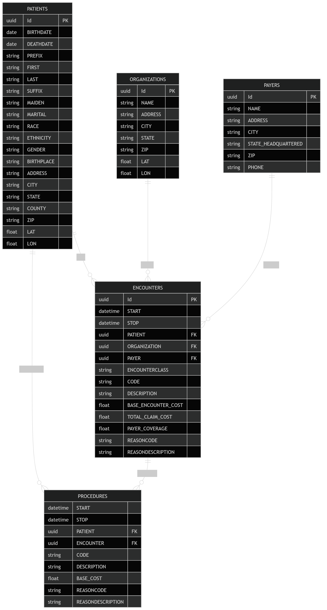

# PiROD
Лабораторная работа 3.

# Задание
## MPP-архитектура и моделирование данных в Greenplum

В рамках данной работы вы решите задачу интеграции Greenplum с другими хранилищами с помощью PXF, а также изучите особенности данного хранилища и ограничения, которые необходимо учитывать при работе с ним.

- Упрощенный вариант: 70% от максимального балла
- Усложненный вариант: полный балл

Этапы выполнения:
- Развернуть с помощью docker compose GreenPlum кластер из одной мастер ноды и двух сегмент нод, а также дополнительное хранилище в соответствие с вариантом
- Выбрать датасет - https://mavenanalytics.io/data-playground. Данные из него загрузить в дополнительное хранилище из вашего варианта, объём загрузки должен быть не менее 3 таблиц. Датасет должен иметь тег Multiple Table. Построить ER-диаграмму для выбранного датасета.
- Загрузить данные в GreenPlum с помощью PXF. При переносе данных на GreenPlum выбрать ключи дистрибьюции, аргументировать свой выбор.
- Проанализировать распределение данных по сегментам. Построить графики демонстрирующие процент распределения данных на сегментах, объяснить почему получена именно такая картина. Оценить перекос данных.
- Сформировать запросы с использованием множества таблиц. Проанализировать планы запросов полученных запросов, изменить ключи дистрибьюции у таблиц и проанализировать изменения планов запросов. Детально объяснить motion для каждого запроса. Общее число запросов должно быть не менее 3.

Усложненный вариант:
- Сформировать Dockerfile для развертывания gpfdist. Смонтировать директорию контейнера и загрузить в нее csv файл. Создать External Table, связанную с gpfdist, выгрузить данные из csv файла в таблицу.

# Решение

- Вариант - MinIO.
- Датасет - [Hospital Patient Records](https://mavenanalytics.io/data-playground/hospital-patient-records).
- Docker образ Greenplum - [woblerr/greenplum](https://hub.docker.com/r/woblerr/greenplum).
- Docker образ MinIO - [minio/minio](https://hub.docker.com/r/minio/minio).

1. Устанавливаем переменные окружения:

```
# Greenplum 
IMAGE_NAME=woblerr/greenplum
TAG=6.27.1-v0.7
GREENPLUM_PASSWORD=gparray
GREENPLUM_DATABASE_NAME=lab3

# Minio
MINIO_ROOT_USER=minioadmin
MINIO_ROOT_PASSWORD=minioadmin
```

2. Запускаем командой `make up` и проверяем, что у нас кластер из одной мастер ноды и двух сегмент нод, а также доступ к MinIO:

Смотрим на конфигурации сегментов:

```bash
gpadmin@pirod_greenplum:~$ psql -d lab3 -c "SELECT content, role, preferred_role, hostname, address, port, datadir
FROM gp_segment_configuration
ORDER BY content, role;"
 content | role | preferred_role |    hostname     |     address     | port |         datadir         
---------+------+----------------+-----------------+-----------------+------+-------------------------
      -1 | p    | p              | pirod_greenplum | pirod_greenplum | 5432 | /data/master/gpseg-1
       0 | p    | p              | pirod_greenplum | pirod_greenplum | 6000 | /data/00/primary/gpseg0
       1 | p    | p              | pirod_greenplum | pirod_greenplum | 6001 | /data/01/primary/gpseg1
(3 rows)
```

Можно увидеть, что у нас 1 coordinator, 2 сегмента и всё на одном сервере.

Проверяем доступ к MinIO:

```bash
gpadmin@pirod_greenplum:~$ ping pirod_minio -c 3
PING pirod_minio (172.19.0.3): 56 data bytes
64 bytes from 172.19.0.3: icmp_seq=0 ttl=64 time=0.763 ms
64 bytes from 172.19.0.3: icmp_seq=1 ttl=64 time=0.398 ms
64 bytes from 172.19.0.3: icmp_seq=2 ttl=64 time=0.349 ms
--- pirod_minio ping statistics ---
3 packets transmitted, 3 packets received, 0% packet loss
round-trip min/avg/max/stddev = 0.349/0.503/0.763/0.185 ms
```

> Команда `make up` создаёт и запускает контейнер, а также внутри `/data/pxf/servers` копирует `minio/s3-site.xml` файл с настройками подключения.

3. Заходим по `http://localhost:9001`, создаём корзину `hospitalpatientrecords` и загружаем CSV файлы: `encounters.csv`, `organizations.csv`, `patients.csv`, `payers.csv` и `procedures.csv`. ER-диаграммы выглядят следующим образом:



4. Загрузка данных в GreenPlum с помощью PXF с ключами дистрибьюции ...

Загрузка данных с помощью PXF производилась ...

Ключи дистрибьюции были выбраны ...

___

Подключение к сегменту `PGOPTIONS='-c gp_session_role=utility' psql -p 6000 -d lab3`.